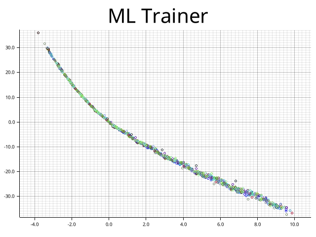

# Roulette Simulator (RSM)
Makes predictions about where the ball will land in roulette using a custom machine learning implementation and input whenever the ball/wheel passes a certain point.
Only works for European roulette (with one zero) since the green zero is used to calibrate the wheel position.

Custom curve fitting based machine learning implementation can be found [here](./spindle/src/ml.rs).

Learns by recording many spins and aligning the data to existing curve using custom ML implementation above.

# Automatic Learning
Able to take a video stream from an online roulette website/other video source and automatically record training data using computer vision.

Will make predictions and decide on how well it is performing.
